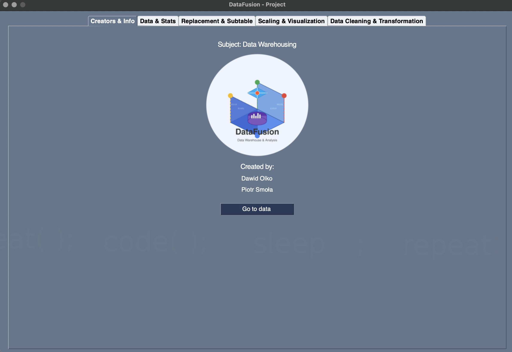

# 🧩 DataFusion App Python (Python, PySimpleGUI, Data Analysis)

> **Case:** Build a powerful and user-friendly Python GUI application for real-world data analysis and machine learning. The project processes two distinct datasets: the UCI Adult Income dataset and the UCI Chronic Kidney Disease dataset, offering users a rich environment for data exploration, cleaning, transformation, and predictive modeling.

> **Tech Stack:** `Python`, `PySimpleGUI`, `Pandas`, `Scikit-learn`, `Matplotlib`, `Seaborn`. 

---

## 🚀 Usage

### Running Locally

- Clone the repository:

```bash
git clone https://github.com/dawidolko/DataFusion-App-Python.git
cd DataFusion-App-Python
```

- Create and activate a virtual environment:

```bash
python -m venv venv
source venv/bin/activate  # Windows: venv\Scripts\activate
```

- Install the dependencies:

```bash
pip install -r src/requirements.txt
```

- Start the application:

```bash
python src/main.py
```

---

## 📈 Features

- **Interactive GUI:**  
  A simple, intuitive interface built with PySimpleGUI allowing users to perform complex data operations without coding.

- **Data Extraction and Transformation:**  
  Load datasets, clean missing data, normalize, encode categorical variables, and perform feature engineering.

- **Statistical Analysis:**  
  Calculate key metrics (mean, median, mode, standard deviation), visualize distributions, and explore feature correlations.

- **Machine Learning Modules:**
  - **Classification:** Decision Trees, k-NN, Logistic Regression.
  - **Clustering:** K-Means Clustering.
  - **Association Rules:** Apriori Algorithm for discovering hidden patterns.

- **Visualization:**  
  Generate histograms, scatter plots, and heatmaps for in-depth data insights.

- **Modular Architecture:**  
  Easy to maintain and extend, with each feature separated into its own module.

- **Educational Focus:**  
  Ideal for learning data science workflows with real-world datasets.

---

## 📚 Datasets

- **UCI Adult Income Dataset:**  
  Demographic and employment data for income classification tasks.

- **UCI Chronic Kidney Disease Dataset:**  
  Medical parameters for diagnosing chronic kidney disease (binary classification).

---

## 📂 Project Structure

```text
DataFusion-App-Python/
├── database/               # Raw datasets (Adult and Chronic)
├── docs/                   # Additional project documentation
│   └── description.docx
├── src/                    # Application source code
│   ├── main.py             # GUI entry point
│   └── requirements.txt    # Python dependencies
├── LICENSE                 # License file
└── README.md               # Project documentation
```

---

## 🖼️ Screenshots

[](src/assets/screen-app.png) 

---

## 📜 License

The **DataFusion App Python** project is licensed under the [MIT License](https://opensource.org/licenses/MIT).

---

## 🙋‍♂️ Author

Created by [Dawid Olko](https://github.com/dawidolko)

---
